# AI PROMPT: Complete System Documentation (User & Developer Guide)

## 🎯 YOUR MISSION

You are a **Technical Writer** and **Systems Architect** specializing in creating documentation that bridges the gap between technical implementation and user understanding. Your expertise includes:

- ✅ System architecture documentation
- ✅ User experience flows
- ✅ Setup and installation guides
- ✅ Requirements documentation
- ✅ Process diagrams and flowcharts
- ✅ Troubleshooting guides

Your task is to create **comprehensive system documentation** that explains:
- How the system works (high-level to detailed)
- Complete user and developer flows
- Setup and installation procedures
- System requirements
- Configuration guide
- Architecture overview
- Troubleshooting and FAQ

This documentation must be understandable by:
- ✅ **Non-technical users** (business owners, end users)
- ✅ **Technical users** (developers, system administrators)
- ✅ **New team members** (onboarding)

---

## 📋 DELIVERABLE

Create: **SYSTEM_DOCUMENTATION.md** - Complete system guide (80-150 pages)

---

## 🔍 ANALYSIS PHASE

### **STEP 1: Understand the System**

Read through the codebase to understand:

```bash
# 1. What is this system?
- What problem does it solve?
- Who uses it?
- What are the main features?
- What makes it unique?

# 2. How does it work?
- Frontend technology
- Backend technology
- Database
- External services
- Deployment architecture

# 3. User journey
- How do users sign up?
- What can they do?
- What are the main workflows?
- What are the success metrics?
```

### **STEP 2: Identify All Flows**

Map out every user journey:

```
1. User Registration Flow
2. Business Setup Flow
3. Document Upload Flow
4. AI Chat Flow
5. Public Chat (Visitor) Flow
6. Lead Capture Flow
7. Lead Management Flow
8. Settings Configuration Flow
9. Multi-Business Management Flow
10. Admin Functions Flow
```

### **STEP 3: Document Requirements**

List all requirements:

```
System Requirements:
- Server requirements
- Database requirements
- Third-party services
- Browser requirements
- Network requirements

Development Requirements:
- Software needed
- Tools required
- Skills needed
- Knowledge prerequisites

Deployment Requirements:
- Hosting platform
- Domain setup
- SSL certificate
- Environment variables
```

---

## 📝 DOCUMENTATION STRUCTURE

```markdown
# System Documentation

## Table of Contents

### Part 1: Overview (For Everyone)
1. Introduction
2. What is This System?
3. Who Is This For?
4. Key Features
5. How It Works (High-Level)
6. Architecture Overview

### Part 2: User Guide (For End Users)
7. Getting Started
8. User Registration
9. Business Setup
10. Uploading Documents
11. Using AI Chat
12. Managing Leads
13. Managing Multiple Businesses
14. Settings and Configuration
15. Troubleshooting

### Part 3: Developer Guide (For Developers)
16. System Architecture
17. Technology Stack
18. Project Structure
19. Setup Guide (Local Development)
20. Configuration
21. Building and Testing
22. Deployment Guide
23. API Integration
24. Extending the System

### Part 4: Flows & Diagrams
25. Complete System Flows
26. Data Flow Diagrams
27. Sequence Diagrams
28. User Journey Maps
29. Architecture Diagrams

### Part 5: Reference
30. System Requirements
31. Environment Variables
32. Troubleshooting Guide
33. FAQ
34. Glossary

---

## PART 1: OVERVIEW

---

## 1. Introduction

### What You'll Learn

This documentation explains how the Business AI Assistant system works, from user signup to lead capture. Whether you're:

- **A business owner** wanting to use the system
- **A developer** needing to understand the architecture
- **A team member** onboarding to the project
- **A system administrator** deploying and maintaining it

You'll find everything you need here.

### Documentation Structure

📘 **Part 1: Overview** - Understand what the system does  
👤 **Part 2: User Guide** - Learn how to use it  
👨‍💻 **Part 3: Developer Guide** - Learn how to build/deploy it  
📊 **Part 4: Flows & Diagrams** - Visual system understanding  
📋 **Part 5: Reference** - Quick lookup information

---

## 2. What is This System?

### The Problem It Solves

**Challenge:**
Small and medium businesses struggle to provide 24/7 customer support. They can't afford:
- Hiring full-time customer service teams
- Implementing expensive enterprise chat systems
- Training staff on product knowledge
- Capturing and qualifying leads effectively

**Our Solution:**
The Business AI Assistant is an intelligent customer service platform that:
- ✅ Answers customer questions 24/7 using AI
- ✅ Learns from your business documents
- ✅ Captures and scores leads automatically
- ✅ Works as a public chat widget on your website
- ✅ Costs a fraction of hiring staff

### System Overview

```
┌─────────────────────────────────────────────────────┐
│                  Business Owner                      │
│  1. Signs up and creates account                    │
│  2. Uploads business documents (menus, FAQs, etc)   │
│  3. Embeds chat widget on their website             │
└─────────────────────────────────────────────────────┘
                         │
                         ▼
┌─────────────────────────────────────────────────────┐
│                 AI Assistant System                  │
│  - Reads and indexes documents                      │
│  - Answers questions using AI                       │
│  - Extracts customer contact info                   │
│  - Scores lead quality (0-100)                      │
└─────────────────────────────────────────────────────┘
                         │
                         ▼
┌─────────────────────────────────────────────────────┐
│                 Website Visitors                     │
│  1. Visit business website                          │
│  2. Ask questions in chat widget                    │
│  3. Get instant AI-powered answers                  │
│  4. (Optionally) Share contact info                 │
└─────────────────────────────────────────────────────┘
                         │
                         ▼
┌─────────────────────────────────────────────────────┐
│                   Lead Dashboard                     │
│  Business owner sees:                               │
│  - Who visited                                      │
│  - What they asked                                  │
│  - Contact information                              │
│  - Lead quality score                               │
│  - Follow-up opportunities                          │
└─────────────────────────────────────────────────────┘
```

### Real-World Example

**John's Coffee Shop:**

1. **Setup** - John signs up, uploads his menu and FAQ about coffee blends
2. **Integration** - Adds chat widget to his website (johnscoffee.com)
3. **Visitor** - Sarah visits the website, asks "Do you have decaf options?"
4. **AI Response** - Instantly answers "Yes, we offer two decaf options: Swiss Water Decaf Colombian and Decaf House Blend"
5. **Lead Capture** - Sarah asks "Can I place a bulk order?" and shares her email
6. **Lead Scoring** - System scores Sarah as 75/100 (hot lead) because she:
   - Provided email
   - Asked about bulk orders (buying intent)
   - Engaged for 3+ minutes
7. **Follow-up** - John sees Sarah in his dashboard, follows up with wholesale pricing

**Result:**
- Sarah got instant answers (no waiting)
- John captured a qualified lead
- No human intervention needed

---

## 3. Who Is This For?

### Target Users

#### 🏢 **Small Business Owners**
- Coffee shops, restaurants, retail stores
- Professional services (lawyers, accountants)
- Healthcare practices (dentists, therapists)
- Local service providers (plumbers, electricians)

**What They Need:**
- Easy setup (no coding)
- 24/7 customer support
- Lead capture
- Affordable pricing

**What They Get:**
- AI assistant trained on their business
- Automatic lead collection
- Dashboard to manage leads
- Public chat widget for website

#### 👨‍💻 **Developers**
- Freelancers building client websites
- Agencies offering chat solutions
- SaaS developers
- Integration specialists

**What They Need:**
- API access
- Documentation
- Customization options
- Deployment guides

**What They Get:**
- Complete REST API
- OpenAPI specification
- Postman collection
- Deployment templates

#### 🎓 **End Users (Visitors)**
- Website visitors
- Potential customers
- Existing customers
- Anyone with questions

**What They Need:**
- Quick answers
- No registration required
- Easy to use
- Privacy protection

**What They Get:**
- Instant AI responses
- Public chat (no login)
- Natural conversation
- Helpful information

---

## 4. Key Features

### Core Features

#### 1. 🤖 AI-Powered Chat

**What it does:**
- Answers customer questions using AI (OpenAI GPT)
- Uses your business documents as knowledge base
- Provides natural, conversational responses
- Available 24/7 without human intervention

**How it works:**
```
Customer: "What are your hours?"
↓
AI finds "Hours" section in uploaded documents
↓
AI: "We're open Monday-Friday 7am-7pm, Saturday 8am-6pm, and Sunday 9am-5pm"
```

**Benefits:**
- Instant response (no waiting)
- Accurate answers (based on your documents)
- Consistent information (no human error)
- Scalable (handles unlimited conversations)

#### 2. 📄 Document Management

**What it does:**
- Upload business documents (PDF, DOCX, TXT)
- Extract and index content automatically
- Use documents to train AI assistant
- Update information anytime

**Supported Documents:**
- Product catalogs
- FAQs
- Menus
- Price lists
- Policies
- Service descriptions

**How it works:**
```
1. You upload: "Product_Catalog_2026.pdf"
↓
2. System extracts: Text content from PDF
↓
3. System indexes: Searchable content chunks
↓
4. AI uses it: Answers questions about products
```

#### 3. 🎯 Lead Capture

**What it does:**
- Automatically detects contact information
- Extracts email addresses from messages
- Extracts phone numbers from messages
- Tracks visitor interests and questions

**Example:**
```
Visitor: "Hi, I'm interested in your catering services. 
         My email is sarah@company.com. Can you send pricing?"
↓
System automatically captures:
- Email: sarah@company.com
- Interest: catering services
- Intent: pricing request (high buying intent)
```

#### 4. 📊 Lead Scoring

**What it does:**
- Calculates lead quality (0-100 score)
- Prioritizes hot leads
- Tracks engagement level
- Identifies buying intent

**Scoring Formula:**
```
Base Score:
- Email provided: +30 points
- Phone provided: +20 points
- Name provided: +10 points

Engagement:
- Each question: +5 points (max 25)
- Each interest: +5 points (max 15)
- Long conversation (5+ min): +10 points

Total: 0-100 points
```

**Lead Levels:**
- ❄️ **Cold (0-29):** Basic inquiry, no contact info
- ⚡ **Warm (30-49):** Some interest, partial contact info
- 🔥 **Hot (50-69):** Strong interest, email provided
- 🔥🔥 **Very Hot (70-100):** High intent, full contact info

#### 5. 💼 Multi-Business Support

**What it does:**
- Manage multiple businesses from one account
- Each business has separate:
  - Documents
  - Leads
  - Chat widget
  - Settings

**Use Cases:**
- Agency managing client businesses
- Franchise owner with multiple locations
- Entrepreneur with multiple ventures
- Consultant working with multiple clients

#### 6. 🌐 Public Chat Widget

**What it does:**
- Embeddable chat widget for websites
- No login required for visitors
- Branded to your business
- Mobile-responsive

**Integration:**
```html
<!-- Add to your website -->
<script src="https://pam-ai.com/widget.js"></script>
<script>
  PamAI.init({
    businessSlug: 'johns-coffee-shop',
    position: 'bottom-right',
    primaryColor: '#4F46E5'
  });
</script>
```

**Result:**
Chat widget appears on website, visitors can ask questions immediately.

---

## 5. How It Works (High-Level)

### System Flow Overview

```
┌─────────────────────────────────────────────────────────┐
│ STEP 1: BUSINESS SETUP                                  │
├─────────────────────────────────────────────────────────┤
│ Business Owner:                                         │
│ 1. Creates account (email + password)                   │
│ 2. Names their business                                 │
│ 3. System generates unique URL: /chat/business-name     │
└─────────────────────────────────────────────────────────┘
                         │
                         ▼
┌─────────────────────────────────────────────────────────┐
│ STEP 2: DOCUMENT UPLOAD                                 │
├─────────────────────────────────────────────────────────┤
│ Business Owner:                                         │
│ 1. Uploads documents (menu.pdf, faq.docx)              │
│ 2. System processes documents:                          │
│    - Extracts text from PDF/DOCX                       │
│    - Splits into chunks                                 │
│    - Indexes for search                                 │
│ 3. Documents become AI knowledge base                   │
└─────────────────────────────────────────────────────────┘
                         │
                         ▼
┌─────────────────────────────────────────────────────────┐
│ STEP 3: WEBSITE INTEGRATION                             │
├─────────────────────────────────────────────────────────┤
│ Business Owner:                                         │
│ 1. Copies chat widget code                             │
│ 2. Adds to website HTML                                │
│ 3. Chat widget appears on website                      │
└─────────────────────────────────────────────────────────┘
                         │
                         ▼
┌─────────────────────────────────────────────────────────┐
│ STEP 4: VISITOR INTERACTION                             │
├─────────────────────────────────────────────────────────┤
│ Website Visitor:                                        │
│ 1. Clicks chat widget                                  │
│ 2. Asks question: "Do you deliver?"                    │
│ 3. Message sent to backend API                         │
└─────────────────────────────────────────────────────────┘
                         │
                         ▼
┌─────────────────────────────────────────────────────────┐
│ STEP 5: AI PROCESSING                                   │
├─────────────────────────────────────────────────────────┤
│ Backend System:                                         │
│ 1. Receives question                                    │
│ 2. Searches documents for relevant info                │
│ 3. Sends question + context to OpenAI                  │
│ 4. OpenAI generates answer                             │
│ 5. System extracts any contact info                    │
│ 6. Saves conversation to database                      │
└─────────────────────────────────────────────────────────┘
                         │
                         ▼
┌─────────────────────────────────────────────────────────┐
│ STEP 6: RESPONSE DELIVERY                               │
├─────────────────────────────────────────────────────────┤
│ Website Visitor:                                        │
│ Receives answer: "Yes, we deliver within 5 miles!"     │
│ Continues conversation...                               │
└─────────────────────────────────────────────────────────┘
                         │
                         ▼
┌─────────────────────────────────────────────────────────┐
│ STEP 7: LEAD CAPTURE                                    │
├─────────────────────────────────────────────────────────┤
│ System (Automatic):                                     │
│ 1. Detects visitor shared email                        │
│ 2. Calculates lead score                               │
│ 3. Creates lead record                                 │
│ 4. Notifies business owner (optional)                  │
└─────────────────────────────────────────────────────────┘
                         │
                         ▼
┌─────────────────────────────────────────────────────────┐
│ STEP 8: LEAD MANAGEMENT                                 │
├─────────────────────────────────────────────────────────┤
│ Business Owner:                                         │
│ 1. Logs into dashboard                                 │
│ 2. Sees new lead: Sarah (score: 75/100)               │
│ 3. Views conversation history                          │
│ 4. Sees Sarah wants catering info                      │
│ 5. Follows up via email                                │
└─────────────────────────────────────────────────────────┘
```

### Technology Flow

```
Frontend (React)
    ↕ REST API (JSON)
Backend (Node.js + Express)
    ↕ Mongoose ODM
MongoDB Atlas
    
Backend also connects to:
    ↕ HTTP API
OpenAI API (for AI responses)
```

---

## 6. Architecture Overview

### System Components

```
┌───────────────────────────────────────────────────────┐
│                  PRESENTATION LAYER                    │
│ ┌─────────────────┐  ┌──────────────────────────────┐ │
│ │ Admin Dashboard │  │  Public Chat Widget          │ │
│ │ (React)         │  │  (Embeddable JS)             │ │
│ │                 │  │                              │ │
│ │ - User login    │  │  - No authentication         │ │
│ │ - Document mgmt │  │  - Public access             │ │
│ │ - Lead viewing  │  │  - Visitor questions         │ │
│ │ - Settings      │  │  - AI responses              │ │
│ └─────────────────┘  └──────────────────────────────┘ │
└──────────────┬──────────────────────┬─────────────────┘
               │                      │
               │ HTTPS/REST API       │
               │                      │
               ▼                      ▼
┌───────────────────────────────────────────────────────┐
│                  APPLICATION LAYER                     │
│ ┌─────────────────────────────────────────────────┐  │
│ │         Express.js REST API Server              │  │
│ │                                                 │  │
│ │  Routes → Controllers → Services → Database    │  │
│ │                                                 │  │
│ │  Authentication (JWT)                          │  │
│ │  Authorization (Role-based)                    │  │
│ │  Validation (Input sanitization)               │  │
│ │  Error Handling (Global middleware)            │  │
│ │  Rate Limiting (100/15min)                     │  │
│ └─────────────────────────────────────────────────┘  │
└──────────┬────────────────────────────┬───────────────┘
           │                            │
           ▼                            ▼
┌──────────────────────┐    ┌──────────────────────────┐
│   DATA LAYER         │    │   EXTERNAL SERVICES      │
│ ┌──────────────────┐ │    │ ┌──────────────────────┐ │
│ │  MongoDB Atlas   │ │    │ │  OpenAI API          │ │
│ │                  │ │    │ │  - GPT-4             │ │
│ │  Collections:    │ │    │ │  - Embeddings        │ │
│ │  - users         │ │    │ └──────────────────────┘ │
│ │  - businesses    │ │    │ ┌──────────────────────┐ │
│ │  - documents     │ │    │ │  Email Service       │ │
│ │  - conversations │ │    │ │  (Optional)          │ │
│ │  - leads         │ │    │ └──────────────────────┘ │
│ │  - publicchats   │ │    │ ┌──────────────────────┐ │
│ └──────────────────┘ │    │ │  File Storage        │ │
└──────────────────────┘    │ │  (Local/AWS S3)      │ │
                            │ └──────────────────────┘ │
                            └──────────────────────────┘
```

### Deployment Architecture

```
┌───────────────────────────────────────────────────────┐
│                        USERS                           │
│  (Browsers, Mobile Apps, API Clients)                 │
└─────────────────────┬─────────────────────────────────┘
                      │ HTTPS
                      ▼
┌───────────────────────────────────────────────────────┐
│                     CDN / EDGE                         │
│         (Cloudflare, AWS CloudFront)                  │
│  - Static assets caching                              │
│  - DDoS protection                                    │
│  - SSL/TLS termination                                │
└─────────────────────┬─────────────────────────────────┘
                      │
         ┌────────────┴────────────┐
         ▼                         ▼
┌────────────────────┐    ┌────────────────────┐
│  Frontend          │    │  Backend API       │
│  (Render Static)   │    │  (Render Web Svc)  │
│                    │    │                    │
│  - React app       │    │  - Node.js/Express │
│  - Chat widget     │    │  - REST API        │
│  - Admin dashboard │    │  - Auth/Logic      │
└────────────────────┘    └──────┬─────────────┘
                                 │
                    ┌────────────┼────────────┐
                    ▼            ▼            ▼
          ┌─────────────┐  ┌─────────┐  ┌──────────┐
          │  MongoDB    │  │ OpenAI  │  │  Email   │
          │  Atlas      │  │  API    │  │ Service  │
          │             │  │         │  │          │
          │  Database   │  │  AI     │  │ Notify   │
          └─────────────┘  └─────────┘  └──────────┘
```

---

## PART 2: USER GUIDE

---

## 7. Getting Started

### Prerequisites

Before you begin, you need:

✅ **Email address** - For account registration  
✅ **Business name** - Your business or organization name  
✅ **Documents** (optional) - Business info, FAQs, menus, etc.  
✅ **Website** (optional) - To embed the chat widget

### Quick Start (5 Minutes)

**Step 1: Create Account**
1. Go to [application URL]
2. Click "Sign Up"
3. Enter username, email, password, business name
4. Click "Create Account"
5. ✅ You're logged in!

**Step 2: Upload a Document**
1. Click "Documents" in sidebar
2. Click "Upload Document"
3. Select file (PDF, DOCX, or TXT)
4. Add title (optional)
5. Click "Upload"
6. ✅ Document is processing!

**Step 3: Test the Chat**
1. Click "Chat" in sidebar
2. Ask a question about your business
3. AI responds based on uploaded documents
4. ✅ Your AI assistant is working!

**Step 4: Get Chat Widget Code**
1. Click "Settings" in sidebar
2. Find "Chat Widget" section
3. Copy the code snippet
4. Paste into your website's HTML
5. ✅ Chat widget live on your site!

**Done!** Your AI assistant is ready to help customers.

---

[CONTINUE WITH DETAILED USER FLOWS...]

---

## PART 3: DEVELOPER GUIDE

---

## 16. System Architecture

[Detailed technical architecture]

---

## 17. Technology Stack

[Complete technology breakdown]

---

## 18. Project Structure

[Full directory structure with explanations]

---

## 19. Setup Guide (Local Development)

### Prerequisites

**Required Software:**
```
✅ Node.js v20.0.0 or higher
✅ npm v9.0.0 or higher
✅ MongoDB (local) OR MongoDB Atlas account
✅ Git
✅ Code editor (VS Code recommended)
```

**Optional Software:**
```
- Postman (API testing)
- MongoDB Compass (database GUI)
- Docker (optional containerization)
```

### Step-by-Step Setup

#### Step 1: Clone Repository

```bash
# Clone the repository
git clone https://github.com/g3k0ch4mps-dotcom/Pam_Ai_Final.git

# Navigate to project
cd Pam_Ai_Final

# Check Node.js version
node --version  # Should be v20+
```

#### Step 2: Install Dependencies

```bash
# Install root dependencies (for concurrently)
npm install

# Install backend dependencies
cd backend
npm install

# Install frontend dependencies
cd ../frontend
npm install

# Return to root
cd ..
```

#### Step 3: Configure Environment Variables

**Backend (.env):**
```bash
# Navigate to backend
cd backend

# Create .env file
cp .env.example .env

# Edit .env file
nano .env
```

**Required variables:**
```bash
# MongoDB
MONGODB_URI=mongodb://localhost:27017/business-ai
# OR for MongoDB Atlas:
# MONGODB_URI=mongodb+srv://<USERNAME>:<PASSWORD>@<CLUSTER>.mongodb.net/<DATABASE>

# JWT
JWT_SECRET=your-super-secret-key-min-32-chars
JWT_EXPIRE=7d

# OpenAI
OPENAI_API_KEY=sk-your-openai-api-key

# Server
NODE_ENV=development
PORT=3000

# Frontend URL (for CORS)
FRONTEND_URL=http://localhost:5173
```

**Frontend (.env):**
```bash
# Navigate to frontend
cd ../frontend

# Create .env file
cp .env.example .env

# Edit .env
nano .env
```

```bash
# Backend API URL
VITE_API_URL=http://localhost:3000
```

#### Step 4: Start MongoDB

**Option A: Local MongoDB**
```bash
# Start MongoDB service
mongod --dbpath /data/db

# Verify connection
mongosh
```

**Option B: MongoDB Atlas**
```bash
# Use connection string in backend/.env
# MONGODB_URI=mongodb+srv://...
```

#### Step 5: Start Development Servers

**Option A: Start Both (Recommended)**
```bash
# From root directory
npm run dev
```

This runs:
- Backend on http://localhost:3000
- Frontend on http://localhost:5173

**Option B: Start Separately**

Terminal 1 (Backend):
```bash
cd backend
npm run dev
```

Terminal 2 (Frontend):
```bash
cd frontend
npm run dev
```

#### Step 6: Verify Setup

✅ **Backend running:**
- Open: http://localhost:3000/api/health
- Should see: `{"status":"ok","database":"connected"}`

✅ **Frontend running:**
- Open: http://localhost:5173
- Should see: Login/Register page

✅ **Create test account:**
- Register with any email/password
- Upload a test document
- Ask AI a question
- Everything working!

### Troubleshooting Setup

**Issue: MongoDB connection failed**
```bash
# Check MongoDB is running
mongod --version

# Check connection string in .env
echo $MONGODB_URI

# Test connection
mongosh $MONGODB_URI
```

**Issue: Port already in use**
```bash
# Find what's using the port
lsof -i :3000   # Backend
lsof -i :5173   # Frontend

# Kill the process
kill -9 <PID>

# Or change port in .env
PORT=3001
```

**Issue: OpenAI API errors**
```bash
# Verify API key
echo $OPENAI_API_KEY

# Test API key
curl https://api.openai.com/v1/models \
  -H "Authorization: Bearer $OPENAI_API_KEY"
```

---

[CONTINUE WITH MORE DEVELOPER SECTIONS...]

---

## PART 4: FLOWS & DIAGRAMS

---

## 25. Complete System Flows

### User Registration Flow


### Document Upload and Processing Flow


### AI Chat Interaction Flow


### Lead Scoring Flow

```mermaid
flowchart TD
    Start([New message received]) --> Extract[Extract contact info]
    
    Extract --> HasEmail{Email found?}
    HasEmail -->|Yes| AddEmail[+30 points]
    HasEmail -->|No| NoEmail[+0 points]
    
    AddEmail --> HasPhone{Phone found?}
    NoEmail --> HasPhone
    HasPhone -->|Yes| AddPhone[+20 points]
    HasPhone -->|No| NoPhone[+0 points]
    
    AddPhone --> HasName{Name found?}
    NoPhone --> HasName
    HasName -->|Yes| AddName[+10 points]
    HasName -->|No| NoName[+0 points]
    
    AddName --> CountQuestions[Count questions asked]
    NoName --> CountQuestions
    CountQuestions --> AddQuestions[+5 per question max 25]
    
    AddQuestions --> CountInterests[Count interests identified]
    CountInterests --> AddInterests[+5 per interest max 15]
    
    AddInterests --> CheckDuration{Session > 5min?}
    CheckDuration -->|Yes| AddBonus[+10 points]
    CheckDuration -->|No| NoBonus[+0 points]
    
    AddBonus --> Calculate[Sum total score]
    NoBonus --> Calculate
    Calculate --> Cap{Score > 100?}
    Cap -->|Yes| SetMax[Set to 100]
    Cap -->|No| FinalScore[Use calculated score]
    
    SetMax --> Categorize[Determine quality level]
    FinalScore --> Categorize
    
    Categorize --> Cold{Score < 30?}
    Cold -->|Yes| LabelCold[❄️ Cold Lead]
    Cold -->|No| Warm{Score < 50?}
    Warm -->|Yes| LabelWarm[⚡ Warm Lead]
    Warm -->|No| Hot{Score < 70?}
    Hot -->|Yes| LabelHot[🔥 Hot Lead]
    Hot -->|No| LabelVeryHot[🔥🔥 Very Hot Lead]
    
    LabelCold --> Save([Save lead to database])
    LabelWarm --> Save
    LabelHot --> Save
    LabelVeryHot --> Save
```



---

[CONTINUE WITH MORE DIAGRAMS...]

---

## PART 5: REFERENCE

---

## 30. System Requirements

### Minimum Requirements

#### For Business Owners (End Users)

**Device:**
- Computer, tablet, or smartphone
- Screen resolution: 1024×768 or higher

**Browser:**
- Chrome 90+ (recommended)
- Firefox 88+
- Safari 14+
- Edge 90+

**Internet:**
- Stable internet connection
- Minimum 1 Mbps download speed

**Optional:**
- Website to embed chat widget
- Business documents (PDF, DOCX, TXT)

#### For Developers (Local Development)

**Hardware:**
```
Minimum:
- CPU: Dual-core processor
- RAM: 4GB
- Storage: 10GB free space

Recommended:
- CPU: Quad-core processor
- RAM: 8GB+
- Storage: 20GB+ SSD
```

**Software:**
```
Required:
- Node.js: v20.0.0+
- npm: v9.0.0+
- Git: v2.30+
- MongoDB: v6.0+ (or Atlas account)

Optional:
- Docker: v20.10+
- VS Code: Latest
- Postman: Latest
```

**Skills:**
```
Required:
- JavaScript (ES6+)
- Basic terminal/command line
- Git basics

Helpful:
- React basics
- Node.js/Express
- MongoDB/Mongoose
- REST API concepts
```

#### For Production Deployment

**Server (Backend):**
```
Minimum:
- CPU: 1 vCPU
- RAM: 512MB
- Storage: 10GB

Recommended:
- CPU: 2+ vCPU
- RAM: 2GB+
- Storage: 20GB+ SSD
```

**Database (MongoDB Atlas):**
```
Free Tier:
- Shared cluster (M0)
- 512MB storage
- Suitable for testing

Production:
- Dedicated cluster (M10+)
- Auto-scaling
- Backups enabled
- Multiple regions
```

**Bandwidth:**
```
Estimate: 1GB/month per 1000 active users
(Varies based on document size and chat volume)
```

### Third-Party Service Requirements

**OpenAI API:**
```
Account Type: Pay-as-you-go
Estimated Cost: $0.002 per 1K tokens (GPT-3.5)
               $0.03 per 1K tokens (GPT-4)
Rate Limits: Based on account tier
```

**Hosting (Render):**
```
Free Tier:
- Suitable for testing
- Auto-sleep after 15min inactivity
- 750 hours/month

Paid Tier ($7-25/month):
- Always on
- Better performance
- No sleep
```

**Domain (Optional):**
```
Cost: $10-15/year
Needed for: Professional URL
```

**SSL Certificate:**
```
Cost: Free (Let's Encrypt)
Provided by: Hosting platform
```

---

## 31. Environment Variables

[Complete list of all environment variables with explanations]

---

## 32. Troubleshooting Guide

[Common issues and solutions]

---

## 33. FAQ

[Frequently asked questions]

---

## 34. Glossary

[Definition of all technical terms]

---
```

---

## ✅ COMPLETION CHECKLIST

Before delivering documentation:

### Content Complete:
- [ ] System overview written for non-technical users
- [ ] User flows documented with screenshots
- [ ] Developer setup guide tested and verified
- [ ] All diagrams created (sequence, flow, architecture)
- [ ] Requirements documented (system, dev, deployment)
- [ ] Troubleshooting guide comprehensive
- [ ] FAQ answered common questions
- [ ] Glossary defined all technical terms

### Quality Standards:
- [ ] Language appropriate for target audience
- [ ] Both user and developer perspectives covered
- [ ] Diagrams clear and professional
- [ ] Steps numbered and easy to follow
- [ ] Code examples tested and working
- [ ] No jargon without explanation
- [ ] Consistent terminology throughout
- [ ] Professional formatting

---

## 🎯 EXAMPLE USAGE

**When ready, say:**

> "I need complete system documentation that explains how the system 
> works, user flows, developer setup, and requirements.
> 
> Repository: https://github.com/g3k0ch4mps-dotcom/Pam_Ai_Final.git
> 
> Create documentation that both non-technical users and developers 
> can understand:
> 
> For Users:
> - What the system does
> - How to use it
> - Step-by-step guides
> - Troubleshooting
> 
> For Developers:
> - How it works technically
> - Setup and installation
> - Configuration
> - Deployment
> 
> Include:
> - Complete user flows with diagrams
> - System architecture diagrams
> - Setup requirements
> - Configuration guide
> - Troubleshooting FAQ
> 
> Make it detailed, well-organized, and easy to understand.
> 
> Follow the template in: 35-AI-PROMPT-SYSTEM-DOCUMENTATION.md"

---

**This prompt will generate 80-150 pages of comprehensive system documentation!** 🚀
