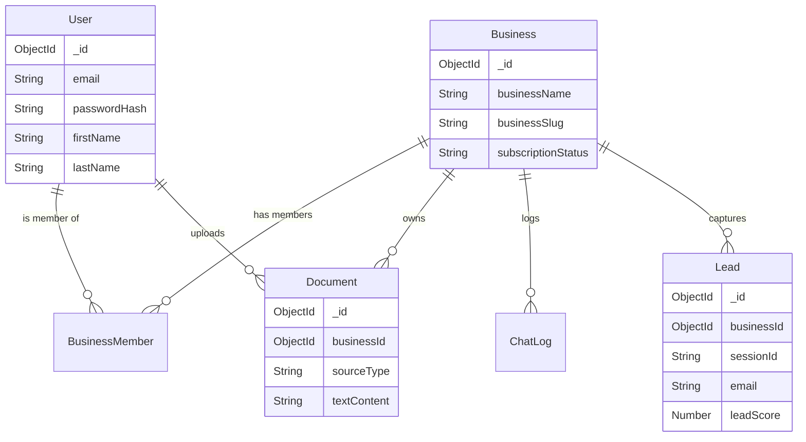

# Database Schema Documentation

## 📊 Overview
The application uses **MongoDB** with **Mongoose** as the ODM. The database stores information about users, businesses, documents, chat logs, and leads.

## 🗄️ Models

### 1. User
**File:** `src/models/User.js`
**Purpose:** Manages user credentials and profile information.

**Schema:**
- `email`: String (Required, Unique, Lowercase)
- `passwordHash`: String (Selected: false)
- `firstName`: String (Required)
- `lastName`: String (Required)
- `isEmailVerified`: Boolean (Default: false)
- `lastLogin`: Date

**Indexes:**
- `email`: unique

### 2. Business
**File:** `src/models/Business.js`
**Purpose:** Represents a business entity in the system.

**Schema:**
- `businessName`: String (Required)
- `businessSlug`: String (Required, Unique, Lowercase)
- `industry`: String
- `subscriptionStatus`: Enum ['free', 'pro', 'enterprise'] (Default: 'free')
- `isActive`: Boolean (Default: true)
- `chatSettings`: Object (isPublic, welcomeMessage, primaryColor)
- `branding`: Object (logoUrl, websiteUrl)

**Indexes:**
- `businessSlug`: unique

### 3. BusinessMember
**File:** `src/models/BusinessMember.js`
**Purpose:** Manages the many-to-many relationship between Users and Businesses with roles.

**Schema:**
- `userId`: ObjectId (Ref: User, Required)
- `businessId`: ObjectId (Ref: Business, Required)
- `role`: Enum ['owner', 'admin', 'member'] (Default: 'member')
- `isActive`: Boolean (Default: true)

**Indexes:**
- `{ userId: 1, businessId: 1 }`: unique (Compound)
- `{ businessId: 1 }`: index

### 4. Document
**File:** `src/models/Document.js`
**Purpose:** Stores metadata for uploaded files and scraped URLs used for RAG.

**Schema:**
- `businessId`: ObjectId (Ref: Business, Required)
- `sourceType`: Enum ['file', 'url'] (Required)
- `filename`, `originalName`, `mimeType`, `size`: (Required if file)
- `sourceURL`: (Required if url)
- `textContent`: String (Full text for search)
- `metadata`: Map of String
- `uploadedBy`: ObjectId (Ref: User)

**Indexes:**
- `businessId`: index (Potentially redundant)
- `{ originalName: 'text', ... }`: TextSearchIndex
- `{ businessId: 1, sourceType: 1 }`: Compound index

### 5. Lead
**File:** `src/models/Lead.js`
**Purpose:** Captures potential customers interacting with the AI chat.

**Schema:**
- `businessId`: ObjectId (Ref: Business, Required)
- `businessSlug`: String (Required)
- `sessionId`: String (Required)
- `email`: String
- `phone`: String
- `name`: String
- `questions`: Array of String
- `chatHistory`: Array of Objects
- `status`: Enum ['new', 'contacted', 'qualified', 'converted', 'lost']
- `leadScore`: Number

**Indexes:**
- `businessId`: index (Potentially redundant)
- `businessSlug`: index
- `sessionId`: index
- `email`: index
- `{ businessId: 1, createdAt: -1 }`: Compound
- `{ businessId: 1, status: 1 }`: Compound

### 6. ChatLog
**File:** `src/models/ChatLog.js`
**Purpose:** Stores history of chat interactions for analytics and cost tracking.

**Schema:**
- `businessId`: ObjectId (Ref: Business, Required)
- `userQuestion`: String
- `aiResponse`: String
- `relevantDocuments`: Array of ObjectId (Ref: Document)
- `cost`: Object (tokens, estimatedCostUSD)

**Indexes:**
- `businessId`: index

## 🔍 Duplicate / Redundant Index Analysis

1.  **Model: Document**
    - `businessId: { index: true }` is likely redundant because of the compound index `{ businessId: 1, sourceType: 1 }`. Mongoose can use the compound index's prefix for searching by `businessId`.

2.  **Model: Lead**
    - `businessId: { index: true }` is redundant. Querying by `businessId` is covered by `{ businessId: 1, createdAt: -1 }` or `{ businessId: 1, status: 1 }`.

## 🔗 Entity-Relationship Diagram

